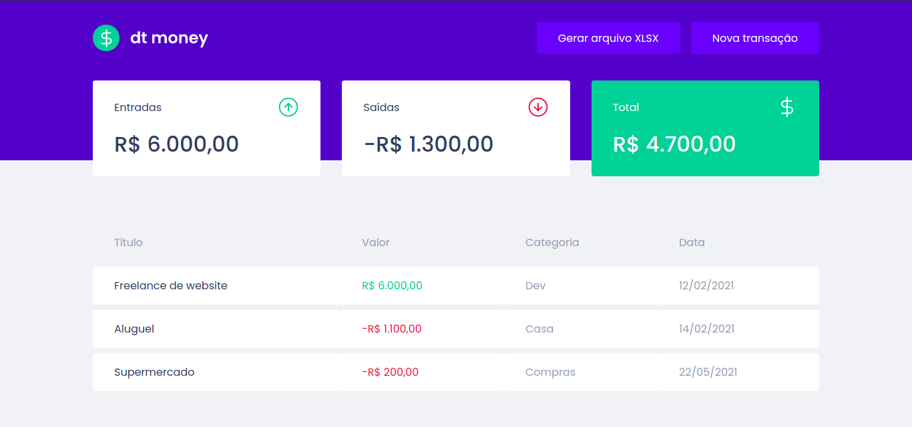

<h1 align="center">
  
</h1>

<p align="center">
  <a href="#-tecnologias">Tecnologias</a>&nbsp;&nbsp;&nbsp;|&nbsp;&nbsp;&nbsp;
  <a href="#-projeto">Projeto</a>
</p>


<br>

<p align="center">
  
</p>


## 🔧 Tecnologias

Tecnologias utilizadas:

- ReactJS
- Typescript
- MirageJS
- Styled Components

## 💻 Projeto

<p><strong>Dtmoney</strong> é uma aplicação construída durante o Chapter 2 do curso Ignite React, promovido pela Rocketseat. A app oferece ao usuário a capacidade de controlar suas finanças pessoais por meio de uma listagem de entradas e saídas de capital.</p>

---

## 🚀 Milha Extra
<p>Além disso, adicionei a app a capacidade de gerar um arquivo XLSX (tabela do excel) contendo o conteúdo inserido na página web e ordenado por tipo (entrada/saída).</p>

#### 🛠️ Instale o projeto na sua máquina:

```bash

    # Clonar o repositório
    $ git clone https://github.com/dtmoney-rocketseat-ignite-react.git

    # Entrar no diretório
    $ cd dtmoney-rocketseat-ignite-react

    # Instalando as dependencias com Yarn
    $ yarn install
    
    # Executando a aplicação
    $ yarn start
```
